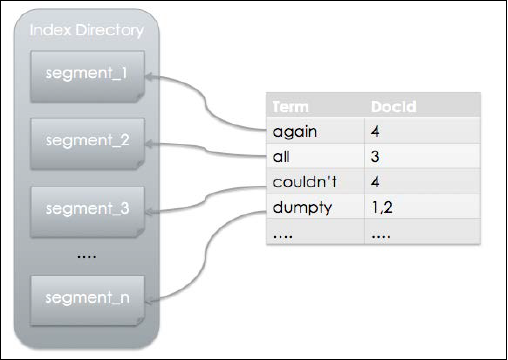
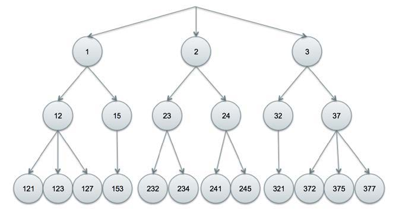

`IndexWriter` 提供创建以及管理索引的功能。

[public IndexWriter(Directory d, IndexWriterConfig conf)](https://lucene.apache.org/core/4_10_0/core/org/apache/lucene/index/IndexWriter.html#IndexWriter(org.apache.lucene.store.Directory,%20org.apache.lucene.index.IndexWriterConfig))

- [Directory]() Lucene 索引存储的位置
- [IndexWriterConfig]() 保存配置信息

**RAMDirectory** 将索引保存在内存中。

**FSDirectory** 将索引保存在文件系统中。

`FSDirectory` 有多种实现，每种实现都有各自的优缺点。大部分情况下使用 `FSDirectory.open(File path)` 让 Lucene 来选择具体的实现。


创建一个 `IndexWriter` 的步骤：

1. 定义一个 `analyzer` 来初始化 `IndexWriterConfig` 
2. 创建一个 `Directory` 来告诉 Lucene 将索引存在哪里
3. 实例化一个 `IndexWriter`

## 1.1 执行搜索

> 示例见：[LuceneTest](https://github.com/Volong/lucenedemo/blob/master/src/github/io/volong/lucenedemo/chapter01/LuceneTest.java)

执行搜索的过程如下所示：


查询字符串进入 `QueryParser.parse(String)`，通过 	`Analyzer` 将字符串变成一组 `token`。然后将 `token` 映射为 `Query` 对象，接着进入到 `IndexSearcher` 执行搜索，返回的结果为 `TopDocs` 对象。

> 注意：在索引以及搜索时使用同一个 `analyzer`，可以获得更好的搜索结果。

# 第二章 分析你的文本

**term** 是 Lucene 索引的基本单位。它与文档相关，包含两个属性：`field` 与 `value`。

**analyzer (分析器)**：分词与过滤处理的容器。

**tokenization (分词)**： 根据指定的分词组件定义的单词边界，将文本进行切分。

分词之后，通过过滤器过滤，将 `token` 转换为 `term`，再进行存储。

分析过程如下所示：


`Tokenizer` 使用 `Reader` 去接收字符串。它产生的有序 `token` 集，被称之为 `TokenStream`。`TokenFilter` 接收 `TokenStream` 进行过滤处理。

## 获取 TokenStream

**TokenStream** 是在分析过程中，组件之间的一种数据格式。

```java
Reader reader = new StringReader("Text to be passed");
Analyzer analyzer = new SimpleAnalyzer();
TokenStream tokenStream = analyzer.tokenStream("myField", reader);
```

## 获取 TokenAttribute 的值

用于获取 `TokenStream` 中 `token` 的值。

几种不同的 `TokenAttribute`：

-   `CharTermAttribute`：用于获取 `token` 实际的文本值。
-   `PositionIncrementAttribute`：当前 `token` 相对于上一个 `token` 的位置。默认值为 `1`。
-   `OffsetAttribute`：原文本中 `term` 的开始位置与结束位置。
-   `TypeAttribute`：用于标识数据类型。
-   `FlagsAttribute`：对特殊的 `token` 进行标识。`TokenFilter` 根据标识执行特定的动作。
-   `PayloadAttribute`：在每个索引的位置存储 `playload`，通常用于评分。

## 使用 PositionIncrementAttribute

表示当前 `token` 相对上一个 `token` 的位置。默认值为 `1`。大于 `1` 则表示两个 `token` 之间不连续，中间有一些 `token` 被隐藏了，例如停顿词等。这个属性在短语匹配时非常有用。

在同义词匹配中，同义词的位置增量 (position increment) 为 `0`，表示跟原词在同一个位置上。

## 使用 PerFieldAnalyzerWrapper

`PerFieldAnalyzerWrapper(Analyzer defaultAnalyzer, Map<String, Analyzer> fieldAnalyzers)`

构造函数接收两个参数：默认的 `analyzer`，字段与 `analyzer` 的映射。

在分析过程中，如果没有在映射关系中找到相应的字段，则会使用默认的 `analyzer`。否则使用对应的 `analyzer`。

## 自定义 TokenFilter

自定义过滤器需要继承自 `TokenFilter`，并重写 `incrementToken()` 方法。

## 自定义 Analyzer

自定义分析器需要继承自 `Anaklyzer`，并重写 `createComponents` 方法。

## 自定义 Tokenizer

自定义分词器可以选择继承 `CharTokenizer`，并重写 `isTokenChar` 方法，可以适用于绝大数的情况。

## 自定义 Attribute

自定义属性需要创建一个 `Attribute` 接口，一个继承 `AttributeImpl` 的实现类与一个继承 `TokenFilter` 的实现类。

Lucene 会去查找以 `Impl` 为后缀的 `Attribute` 实现类。

# 第三章 索引数据

文档与倒排索引的关系：


索引文件在物理被段进行分割，段的命名格式为 `segments_1`、`segments_2` 等等。

属于同一个段的文件，文件名相同，但是扩展名不同。

每一个段都是一个独立的索引，可以被单独进行搜索。

添加一个新的文件可以生成一个新的段。

索引段示例图：



`IndexReader` 会在内部对段进行合并，所以我们不需要考虑考虑索引分段的问题。

## 获取 IndexWriter

Lucene 提供了几个选项来控制索引的打开。

配置对象 `IndexWriterConfig` 用来设置 `IndexWriter`，并提供了三个 `OpenMode` 选项来打开索引。

-   **APPEND：**打开一个已经存在的索引，允许 `IndexWriter` 进行更新。不会新建索引。如果指定的索引不存在，则会抛出 `IndexNotFoundException`。
-   **CREATE：**如果索引不存在，则新建，否则进行替换。
-   **CREATE_OR_APPEND：**默认为这个选项。如果没有找到索引，则新建，否则 `IndexWriter` 在已存在的索引上进行追加。

## 创建 StringField

任何存储在这个字段中的值都会被索引，但是不会被分词，整个字符串会当作一个词。

## 创建 TextField

`TextField` 可以进行分词处理，对于存储非结构化的文本非常有用。

## 创建数值字段

Lucene 提供了四种类型的字段来存储数字。它们分别是 `IntField`、`FloatField`、`LongField`、`DoubleFiled`。

Lucene 内部将数字当作一个词来处理，通过 `trie` 树来索引它们。

如下所示：

在 `1` 的分支下，我们可以获取以 1 开头的 DocId。在 `12` 的分支下，我们可以获取以 12 开头的 DocId。假如我们要查找范围在 230 到 239 中的文档，Lucene 只需要找到 23 这个节点，然后返回它下层所有的 DocId 即可。使用这种方式可以提高 Lucene 处理数字的能力。

节点的数量可以通过 `precisionStep` 的值来进行调整。值比较小会产生大量的节点，将会消耗更多的磁盘空间，但是同时会提高范围查询的性能。该值可以在创建 `FieldType` 时进行更改。默认值为 `4`，是 Lucene 团队权衡磁盘占用与性能消耗所作出的选择。

如果你想基于数值字段进行排序，那么应该新建一个单值字段 (设置 `precisionStep` 的值为 `Integer.MAX_VALUE` 可以保证索引不会产生分支)，因为这比范围索引更加有效。


 